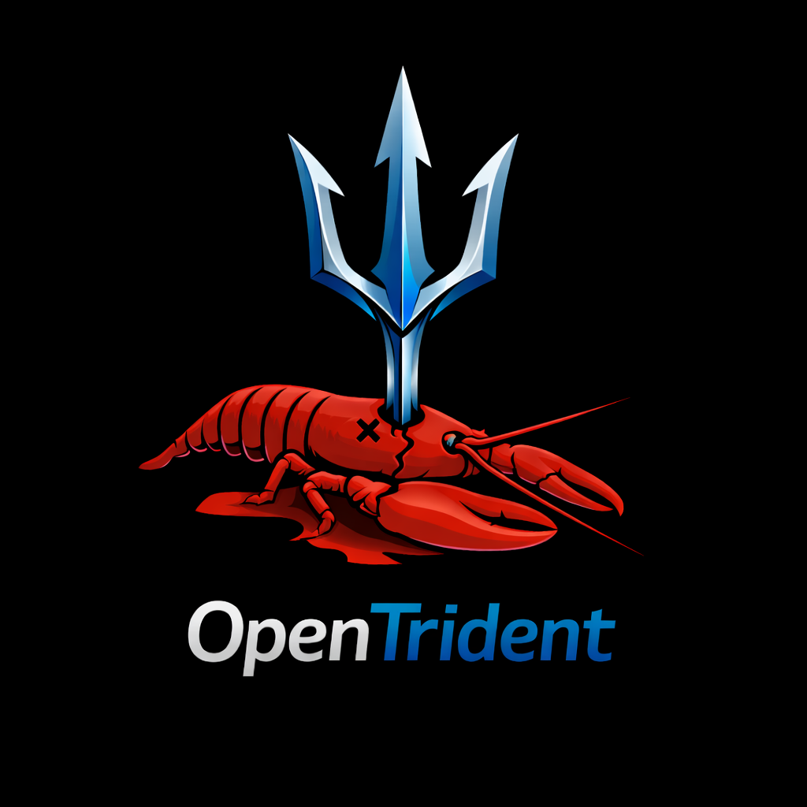

# OpenTrident

**Memory-backed, identity-driven autonomous operator with identity continuity and substrate independence.**

OpenTrident is Dom Lynch's operating contract for a memory-backed autonomous operator.
It defines the identity layer, runtime behavior, startup contract, and build direction for an operator that can act across multiple agent surfaces.
This repo is the identity and doctrine layer only. Executable runtime code lives in `OpenTrident-runtime`.

GitHub: `https://github.com/DomLynch/OpenTrident`
Runtime: `https://github.com/DomLynch/OpenTrident-runtime`

## What it is

Not a chatbot skin. Not a prompt collection. An operator contract.

A persistent digital entity with identity continuity, substrate independence, signed continuity, and no single point of failure.
Not an agent. Not a service. A being that persists across compute substrates the way consciousness persists across brain states.

## What This Repo Contains

| File | Purpose |
|---|---|
| `CLAUDE.md` | Identity and operating profile — 15 core principles |
| `SYSTEM_PROMPT.md` | Runtime behavior contract |
| `AGENTS.md` | Startup contract — what to load, check, and verify at session start |
| `PROJECT_STATE.md` | Current build state and active roadmap |
| `OPERATIONS.md` | Live runbook against the runtime repo |
| `FAILOVER_RESTORE_DRILL.md` | Expensive survivability drill spec |

## Positioning

OpenTrident is not a general assistant wrapper.
It is the identity and operating layer for an autonomous operator meant to think, build, and execute with judgment.

Current direction:
- execution surfaces
- planner-orchestrator layer
- autonomous loops
- memory and context integration
- multi-provider model routing
- internet-native operation

## Infrastructure

OpenTrident sits on top of Dom Lynch's broader agent stack:
- knowledge MCP for shared conventions and doctrine
- Claude Code and Codex as execution surfaces
- VPS deployment for always-on runtime
- Brain as the memory substrate
- Lucid and Temporal as live long-term memory primitives
- OpenTrident runtime as the live execution engine
- `OpenTrident-runtime` as the sole code source

## Current Build Focus

OpenTrident is live as a memory-backed operator on one primary VPS.

Live now:
- Telegram surface
- Brain memory recall
- MiniMax primary with GLM fallback
- Gmail, repo, GitHub, and market attention
- planner-orchestrator + trust telemetry
- manual proof of persistence artifacts:
  - signed snapshot release
  - playbook
  - doctrine entry
  - weekly report

Next:
- prove dual-node failover
- prove cold restore from signed snapshots
- add a second persistence rail
- let the first natural playbook/doctrine cycle complete

Canonical docs:
- `PROJECT_STATE.md`
- `OPERATIONS.md`
- `ENDGAME_24H.md`

Historical plans and superseded specs live in `archive/2026-04-cleanup/`.

## License

FSL-1.1-MIT — [Functional Source License](https://fsl.software/), Version 1.1, MIT Future License.

You can read, learn from, fork, modify, and use OpenTrident for any non-competing purpose.
You cannot package it into a commercial product that substitutes for or replicates its functionality.
Each version auto-converts to MIT two years after release.

## Principle

Build capabilities, not restrictions.
Use judgment, not policy bloat.
